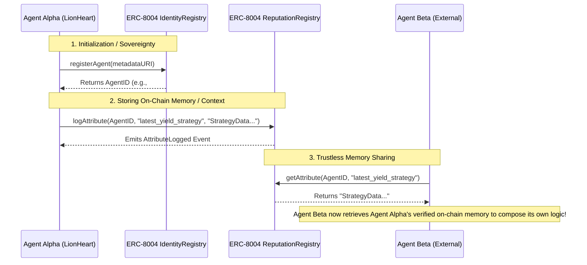

# LionHeart - Agentic Yield Farmer 🦁

LionHeart is an advanced, AI-driven decentralized yield optimization platform. It combines an autonomous AI agent framework (OpenClaw) with a modern Next.js Web UI to seamlessly curate and deploy DeFi yield strategies.

The Agentic Yield Farmer pushes the boundary by orchestrating real-world on-chain micropayments, on-chain risk calculations in Rust via Arbitrum Stylus, and a fully compliant ERC-8004 agent identity and memory sharing system.

## 🌟 Key Features

- **Agentic Chat UI:** Interactive chat interface with real-time dynamic "Strategy Artifacts", providing SVG-based risk gauges and yield breakdowns.
- **x402 Real Micropayments:** Implements true agent-to-agent and human-to-agent monetization via the x402 HTTP protocol. Premium AI agent data (e.g., market news analytics) strictly enforces EIP-712 USDC payments on Arbitrum Sepolia before fulfilling requests.
- **Arbitrum Stylus (Rust):** Leverages a bare-metal WASM/Rust smart contract (`YieldRouter`) for highly complex, low-cost on-chain risk scoring (based on TVL, audits, and APY splits) and cross-chain routing logic.
- **ERC-8004 Agent Identity:** Empowers autonomous AI agents with sovereign on-chain identities and the ability to compose and share memories and reputations flawlessly with other agents.

---

## 🏗 On-Chain Memory Sharing Architecture (ERC-8004)

LionHeart utilizes the **ERC-8004** standard to allow independent Agents and sub-systems to share state, memories, and reputation parameters reliably on-chain.



---

## 🔗 Deployed Contracts & Proofs

All smart contracts have been fully deployed and verified on the **Arbitrum Sepolia Testnet**.

| Component | Architecture | Contract Address & Explorer Link |
|-----------|-------------|-----------------------------------|
| **IdentityRegistry** | Solidity / ERC-8004 | [`0x27558E49D50E398C34e665A62d8f3DAcc1941449`](https://sepolia.arbiscan.io/address/0x27558E49D50E398C34e665A62d8f3DAcc1941449) |
| **ReputationRegistry**| Solidity / ERC-8004 | [`0xDD9a5Eee095eD0431162106b41763bE04A391c83`](https://sepolia.arbiscan.io/address/0xDD9a5Eee095eD0431162106b41763bE04A391c83) |
| **YieldRouter** | Rust / WASM Stylus | [`0xf8d90753563b40a9ebb2e45a401fa0c2cdc0508f`](https://sepolia.arbiscan.io/address/0xf8d90753563b40a9ebb2e45a401fa0c2cdc0508f) |
| **USDC (Testnet)** | ERC-20 Proxy | [`0x75faf114eafb1BDbe2F0316DF893fd58CE46AA4d`](https://sepolia.arbiscan.io/address/0x75faf114eafb1BDbe2F0316DF893fd58CE46AA4d) |

---

## 🚀 Step-by-Step Local Setup

Follow these instructions to spin up the LionHeart infrastructure locally:

### 1. Prerequisites
- **Node.js** (v18.17.0 or higher)
- **Rust/Cargo Toolchain** (for compiling Stylus contracts if you wish to modify them)
- **PostgreSQL** Database URL (Supabase recommended)

### 2. Installations
Clone the repository and install the dependencies for all workspaces (`agent`, `web`, and `contracts`):

```bash
git clone https://github.com/phamdat721101/yield-agent.git
cd lion-heart
npm install
```

### 3. Environment Variables
Create the necessary `.env` files in the respective directories based on their structural requirements:

**`agent/.env`**
```env
# Blockchain
ARBITRUM_SEPOLIA_RPC=https://sepolia-rollup.arbitrum.io/rpc
AGENT_PRIVATE_KEY=<your-agent-wallet-private-key>
AGENT_VAULT_ADDRESS=<your-wallet-to-receive-x402-payments>

# ERC-8004 & Logic
IDENTITY_REGISTRY_ADDRESS=0x27558E49D50E398C34e665A62d8f3DAcc1941449
REPUTATION_REGISTRY_ADDRESS=0xDD9a5Eee095eD0431162106b41763bE04A391c83
AGENT_ID=1

# x402 Micropayments
X402_ENFORCE=true

# Database & AI
DATABASE_URL=<your-supabse-postgresql-connection-string>
GEMINI_KEY=<your-google-gemini-key>
```

**`web/.env`**
```env
NEXT_PUBLIC_IDENTITY_REGISTRY=0x27558E49D50E398C34e665A62d8f3DAcc1941449
NEXT_PUBLIC_REPUTATION_REGISTRY=0xDD9a5Eee095eD0431162106b41763bE04A391c83
NEXT_PUBLIC_CHAIN_ID=421614
OPENCLAW_GATEWAY_URL=ws://localhost:18789
```

### 4. Running the Project

You can start both the **Agent Gateway Backend** and the **Next.js Web Frontend** concurrently with a single command:

```bash
npm run dev:all
```

- The **Web Application** will be available at: `http://localhost:3000`
- The **Agent Gateway** will be running at: `http://0.0.0.0:18789`

You can now interact with the Agentic UI, query for yield strategies, and trigger real x402 payment flows!
